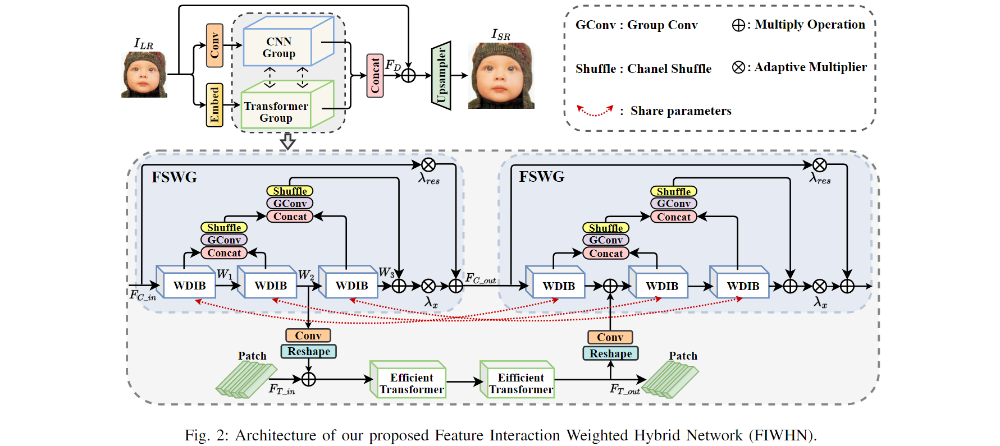

## Efficient Image Super-Resolution with Feature Interaction Weighted Hybrid Network (IEEE TRANSACTIONS ON MULTIMEDIA, 2024)

> [[Paper(arxiv)](https://arxiv.org/abs/2212.14181)] &emsp; [[Paper(IEEE)]()] &emsp; [[Code](https://github.com/24wenjie-li/FIWHN/)] &emsp;


<p align="center">
  
</p>

---

## Prerequisites:
```
1. Python >= 3.6
2. PyTorch >= 1.2
3. numpy
4. skimage
5. imageio
6. tqdm
7. timm
8. einops
```

## Dataset
We used only DIV2K dataset to train our model. To speed up the data reading during training, we converted the format of the images within the dataset from png to npy. 
Please download the DIV2K_decoded with npy format from <a href="https://pan.quark.cn/s/43248032bab2">here</a>.[Quark Netdisk]

The test set contains five datasets, Set5, Set14, B100, Urban100, Manga109. The benchmark can be downloaded from <a href="https://pan.baidu.com/s/1Vb68GWERriLmJRtYfm2uEg">here</a>.[Baidu Netdisk][Password:8888]

Extract the file and place it in the same location as args.data_dir in <a href="https://github.com/24wenjie-li/FIWHN/blob/master/option.py">option.py</a>.

The code and datasets need satisfy the following structures:
```
├── FIWHN  					# Train / Test Code
├── dataset  					# all datasets for this code
|  └── DIV2K_decoded  		#  train datasets with npy format
|  |  └── DIV2K_train_HR  		
|  |  └── DIV2K_train_LR_bicubic 			
|  └── benchmark  		#  test datasets with png format 
|  |  └── Set5
|  |  └── Set14
|  |  └── B100
|  |  └── Urban100
|  |  └── Manga109
 ─────────────────
```

## Results
All our SR Results can be downloaded from <a href="https://pan.baidu.com/s/1PcpDs5MWeDhNh6S4lLCR6g ">here</a>.[Baidu Netdisk][Password:8888]

All pretrained model can be found in <a href="https://github.com/24wenjie-li/FIWHN/tree/master/experiments">experiments</a>.

## Training
```
  # FIWHN x2
  python main.py --scale 2 --model FIWHNx2 --patch_size 96 --save experiments/FIWHNx2
  
  # FIWHN x3
  python main.py --scale 3 --model FIWHNx3 --patch_size 144 --save experiments/FIWHNx3
  
  # FIWHN x4
  python main.py --scale 4 --model FIWHNx3 --patch_size 192 --save experiments/FIWHNx3
```

## Testing
Note: Due to the time lapse, I have graduated from the original lab, and server cleanup resulted in the loss of original model weights . Therefore the current open source weighting results will have a floating error of 0.01~0.02 dB in the PSNR metrics for some of the test sets, but the results for most of the datasets are consistent with the original!
```
# FIWHN x2
python main.py --scale 2 --model FIWHNx2 --save test_results/FIWHNx2 --pre_train experiments/model_best_x2.pt --test_only --save_results --data_test Set5

# FIWHN x3
python main.py --scale 3 --model FIWHNx3 --save test_results/FIWHNx3 --pre_train experiments/model_best_x3.pt --test_only --save_results --data_test Set5

# FIWHN x4
python main.py --scale 4 --model FIWHNx4 --save test_results/FIWHNx4 --pre_train experiments/model_best_x4.pt --test_only --save_results --data_test Set5
```

## Test Parmas and Muti-adds
Note：You need to install torchsummaryX!
```
# Default FIWHNx4
python test_summary.py
```

## Acknowledgements
This code is built on [EDSR (PyTorch)](https://github.com/thstkdgus35/EDSR-PyTorch) and [DRN](https://github.com/guoyongcs/DRN). We thank the authors for sharing their codes.


## :e-mail: Contact

If you have any question, please email `lewj2408@gmail.com`

